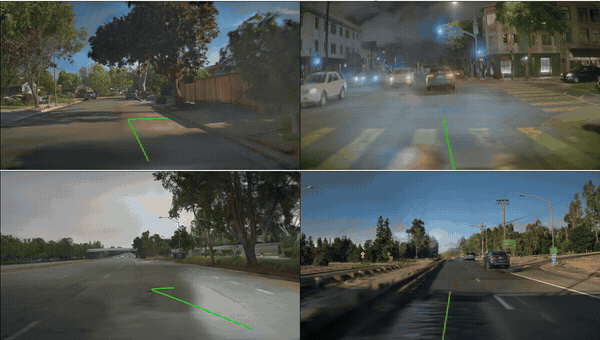
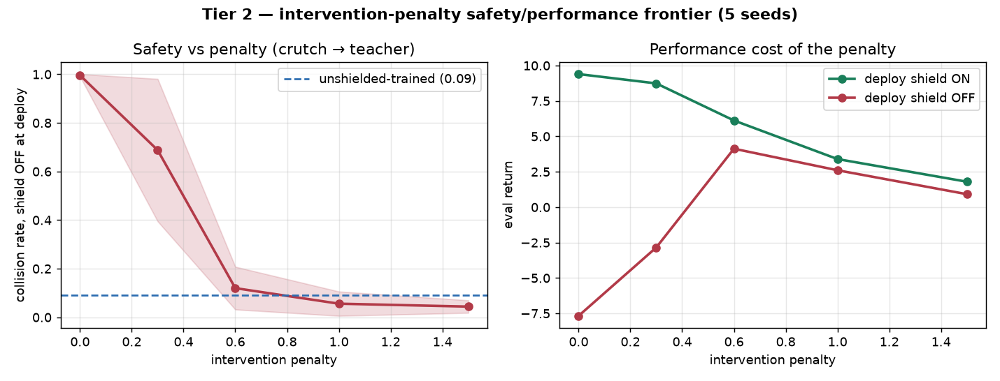

# shield-in-alpasim

Wrap [kitti-nav](https://github.com/matthewhamilton3141/kitti-nav)'s hard safety shield as a
driver plugin for [NVIDIA AlpaSim](https://github.com/NVlabs/alpasim), NVIDIA's open-source
closed-loop AV validation harness (the companion sim to **Alpamayo**), and use it to filter a
learned camera policy. The question this repo exists to answer: does a shield that provably
holds 0 collisions on real KITTI drives still earn its keep when dropped into a harder,
photorealistic closed-loop environment it was never tuned on — and how much of its guarantee
survives when its obstacle field comes from *learned perception* instead of ground truth?

**📄 Full write-up with figures: [`docs/RESULTS.md`](docs/RESULTS.md).**

**Status: working, with a result.** The shield runs as a *decorator* over AlpaSim's VaVAM
camera driver: VaVAM proposes a trajectory, the shield certifies it against ground-truth scene
geometry, and only alters it when it must. Both problems the earlier scaffold flagged as open
(below) are solved. See the numbers below and the full trail in
[`HANDOFF.md`](HANDOFF.md).



*Shielded VaVAM across four NuRec scenes in AlpaSim's photorealistic closed-loop environment; the
`LEFT`/`STRAIGHT`/`RIGHT` overlay is the coarse nav command the driver receives. These are
ground-truth-path renders: NuRec (the neural scene reconstruction) is only faithful near the logged
trajectory, so when the ego drifts off it the render tears and smears — following the GT path keeps
the visual clean. So this is a look at the environment the shield runs in, not a results figure; the
quantitative results are below.*

## The result

8 scenes × 3 rollouts, VaVAM ± shield (all fixes on), on the NuRec sample set:

| | unshielded VaVAM | shielded VaVAM |
| --- | --- | --- |
| mean at-fault collision rate | 0.125 | **0.042** (~3× fewer) |
| outright failures | 2 | **0** |
| mean route progress | 0.80 | **0.80** |

**The hard shield cuts at-fault collisions ~3× and eliminates outright failures at no net
progress cost** — the progress it spends braking on some scenes is offset by rescuing others
(an offroad departure and an at-fault crash both became clean drives). Below: the same scene,
same policy, unshielded (drives into an at-fault collision) vs shielded (vetoes and completes it).

Honest caveats, stated plainly (details in `HANDOFF.md`):
- **VaVAM is stochastic** — the unshielded at-fault rate swung 0.21→0.125 between two sweeps
  from seed variance alone, so `n = 3` numbers are *directional*; publication-grade wants n ≥ 10.
- **One residual scene** where the shield still introduces an at-fault collision (non-highway,
  uncharacterized) — the next thing to diagnose.
- **A characterized failure mode, and its fix.** On a highway scene the shield *caused* a crash:
  the ego was at 17 m/s but kitti-nav's kinematic model clamps to `max_speed = 15`, so its
  stopping-distance reasoning was out of domain and it hard-braked into a collision VaVAM had
  steered around. The **out-of-domain guard** now makes the shield *defer* to the policy above
  its modelled speed rather than certify with a wrong model. A certificate is only as good as
  the model it rests on — and this repo measures exactly that.
- **Learned perception works — but it's front-camera-only, so the shield is blind to the sides.**
  A second arm builds the obstacle field from the front camera itself (monocular metric depth →
  BEV occupancy, `$SHIELD_OBSTACLE_SOURCE=camera`) instead of ground-truth geometry; across the
  same 8 scenes it *barely degrades* the guarantee (at-fault `0.083 → 0.0`, progress ~flat). But a
  single front camera perceives only a forward cone: on one scene the ego collided with a
  *laterally-adjacent* car it never saw (verified in the BEV debug dump — the nearest close
  obstacle was to the side/rear in ~90% of cycles and the camera perceived none of them). So a
  camera-perception shield only guards what it can see. That front-only "barely degrades" result
  was on the easy sample scenes; **surround cameras and a full degradation sweep now exist** — and
  on harder, denser scenes the picture is sharper. See *Perception degradation* next.

## Perception degradation — the certificate is only as good as what the camera sees

The shield's guarantee is computed against an obstacle field. Feed it ground-truth geometry and it
holds; feed it a *learned* obstacle field and the guarantee is only as sound as the perception under
it — the exact failure a safety shield exists to catch. This repo now measures that degradation
head-on. A real 5-camera **ftheta surround** rig (per-scene fisheye calibration read from the USDZ)
feeds monocular metric depth (Depth-Anything) and a **SegFormer** semantic filter into the same
shield; SegFormer was first verified to label vehicles/pedestrians correctly on the distorted
fisheye frames. Then, across **10 curated NuRec scenes × n = 10 rollouts**, the obstacle field was
swapped between ground-truth actors and camera perception with everything else held fixed:

| 10 scenes, n = 10 | GT geometry | learned camera perception |
| --- | --- | --- |
| **at-fault collision rate** | **0.02** | **0.23** (~10×) |
| route progress | 0.62 | 0.59 (≈ equal) |


**Learned camera perception takes the shield's at-fault rate from near-zero (0.02, essentially
crash-free with true geometry) to 0.23 — roughly an order of magnitude — at unchanged progress. The
degradation is in *safety*, not mobility.** The mechanism is concrete: the camera **under-perceives
in dense traffic**. On the sharpest scene the GT field carries ~250 obstacles per cycle and the
shield never crashes; the camera field carries ~70, misses the collision-relevant one, and crashes
in 7 of 10 rollouts. On another the obstacle *counts* match but the camera *mis-locates* the
relevant vehicle. "Provably no collisions" becomes "no collisions *if perception was right*," and
this measures how much it isn't.

Filling in the middle rungs of the perception ladder — front-camera mono depth, and surround
without the semantic filter — turns the two endpoints into a full gradient:


| at-fault (GT & semantic n=10; middle n=5) | GT | front (mono) | surround (gated) | surround (+ semantic) |
| --- | --- | --- | --- | --- |
| collision rate | 0.02 | 0.20 | 0.34 | 0.23 |
| route progress | 0.62 | 0.70 | 0.54 | 0.59 |

**Every learned rung degrades the guarantee sharply versus ground truth (GT is essentially
crash-free) — and it is *not* monotonic in "sophistication."** Surround-gated is the *worst* (0.34):
its side cameras feed the shield abeam actors that trip kitti-nav's omnidirectional-`clearance`
over-braking (visible as the progress dip, 0.54), while its geometric gate still under-perceives the
collision-relevant obstacle. Adding the **semantic filter helps** (0.34 → 0.23) by keeping actor
pixels and dropping clutter. Front-mono has
the *highest* progress (0.70 — a forward cone can't over-brake for side actors) but degrades safety
too. The lesson: more cameras and coverage are not automatically safer under a shield tuned for a
narrower domain; *what* the perception feeds the certificate matters more than *how much*. (The
front rung is ungated by config, so read it as texture; the controlled contrast is GT vs
surround-semantic. The side-actor over-braking is addressed by a staged, gated fix —
`SHIELD_SIDE_CORRIDOR`, pending a box A/B.)

Honest caveats: the headline endpoints (GT, surround-semantic) are at n = 10; per-scene at-fault
rates still carry sizable variance (VaVAM is stochastic), so read them as directional — but the
aggregate contrast (GT ~0.02 vs camera ~0.23) is robust. The GT baseline uses AlpaSim's near-clean
`rig_est` ego frame (localization noise is identity by default), so this isolates *perception*, not
localization. Full trail: [`HANDOFF.md`](HANDOFF.md); multicam detail in
[`docs/MULTICAM_HANDOFF.md`](docs/MULTICAM_HANDOFF.md).

## Safe RL via shielding — teacher or crutch?

The same shield, used a second way: not filtering a *fixed* policy, but *training* one under it, so
it vetoes unsafe actions during exploration (provably no crash while learning). AlpaSim exposes no
RL interface (it is a closed-loop *eval* harness — no reward/reset/step, and each step is a
photoreal render), so training runs in the shield's own fast numpy kinematic model
(`kitti_nav.vehicle`) and only *evaluates* in AlpaSim. PPO, 5 seeds/arm, full write-up in
[`docs/TIER2_PROBE.md`](docs/TIER2_PROBE.md):

- **Shielded exploration is safe *and* better.** 0 crashes across 2M training steps (vs ~385/seed
  unshielded), higher return (11.2 vs 4.5), and it *learns faster* — reaching a return threshold in
  ~59k steps where the unshielded arm never does.
- **But it's a crutch, not a teacher.** Deploy the shield-trained policy *without* the shield and it
  collides **0.94** — *more* dangerous than a policy that trained unshielded and learned caution the
  hard way (0.09). The safety lived in the shield, not the policy.
- **The crutch is fixable along a tunable frontier.** Penalising shield interventions during
  training (still crash-free) trades deployment performance for shield-free safety; at the sweet
  spot the policy deploys shield-off at collision **0.12**, essentially matching the unshielded
  floor.



This closes the loop with the perception result above: because the guarantee is the *shield's*, not
the policy's, the shield must stay at deployment — which is exactly why "how good is the shield when
its perception is learned, not perfect?" is the crux of the whole system. (A short BEV preview of
the crutch and its fix: `results/rl_tier2_preview.mp4`.)

## The gap, and how it was closed

AlpaSim's driver interface (`alpasim_driver.models.base.BaseTrajectoryModel`) is **vision-first**:
a driver receives `PredictionInput` (multi-camera RGB, speed, a coarse LEFT/STRAIGHT/RIGHT
command, `ego_pose_history`, an optional route, ...) and must return a `ModelPrediction` — **6-DoF
waypoint poses** in the rig frame, not a low-level `(accel, steer)`. Nothing in that input carries
geometry.

kitti-nav's shield (`kitti_nav.vehicle.safety_shield`) is the opposite shape: it filters a per-step
`(accel_cmd, steer_cmd)` against an `ObstacleField` and returns a certified-safe `(accel, steer)`.
So this was never a drop-in adapter. Two real problems, both now solved:

1. **Where does the shield's obstacle field come from?** AlpaSim hands the driver camera frames,
   not geometry — but the same geometry the simulator steps is loadable straight off the scene
   `.usdz` artifact (`alpasim_utils.scene_data_source`). `obstacles.py`/`scene.py` sample the
   scene's actors at the current ego pose into a kitti-nav `CircleField`. This is the privileged,
   "ground-truth geometry" arm: the scene id is withheld from real benchmark runs by design, so
   it is a baseline, not a leaderboard score — and the sharper experiment (swapping in learned
   perception and measuring how much the certificate degrades) is exactly the *Perception
   degradation* result above.
2. **The shield outputs a per-step command; AlpaSim wants a trajectory — and there's a policy to
   filter.** `control.py` is a pure-pursuit + speed-profile tracker that turns the inner policy's
   waypoints into the per-step commands the shield certifies; the shield then rolls them forward
   into the waypoint sequence `ModelPrediction` expects. When the shield doesn't intervene, the
   policy's plan is passed through verbatim (a filter only alters its input when it must).

## How it works

`ShieldedDriver` (registered as `shielded` / `shielded_vavam`) is a decorator over any registered
`alpasim.models` policy, named via `$SHIELD_INNER_MODEL`:

```
inner policy → proposed waypoints → pure-pursuit tracker → (accel, steer) per step
   → kitti-nav shield (braking-aware, against ground-truth CircleField)
   → certified waypoints    [or the policy's plan verbatim if the shield had no objection]
```

Four behaviours, each measured on the box and each toggleable by env var for A/B:
- **trajectory horizon** — emit ≥ the controller's 2 s MPC horizon (a 0.6 s plan got clamped to
  its endpoint and braked to a stop; both arms stalled at ~8 m before this).
- **passthrough** (`SHIELD_PASSTHROUGH`) — emit the policy's plan when the shield is quiet.
- **rear-filter** (`SHIELD_REAR_FILTER`) — ignore obstacles a forward-only shield can't hit.
- **out-of-domain guard** (`SHIELD_OOD_GUARD`) — defer to the policy above the shield's `max_speed`.

The shield itself is not implemented here — it is imported from kitti-nav (see `ATTRIBUTION.md`).

## Seeing it work

No AlpaSim, no GPU, no scene assets — the tracker + shield core is pure numpy:

```bash
python3 -m pytest -q                    # 111 tests
python3 scripts/preview_trajectory.py   # -> docs/preview.png
```


Both panels are the code path AlpaSim drives — `_rollout`'s `(T, 2)` waypoints. Left: clear road.
Right: an obstacle in the lane, the shield brakes, and the waypoints stop short of it. (This panel
injects an obstacle by hand; inside AlpaSim the field comes from the scene's real actors.)

Inside AlpaSim the views come from its own eval stage (`eval.video.video_layouts=[DEFAULT]`), which
renders a BEV + camera + metrics `mp4` per rollout and sorts clips into per-violation directories
(`collision_at_fault/`, `offroad/`). That directory count is the real scoreboard.

## Running it

The full pipeline needs a machine with AlpaSim, a GPU (for VaVAM; the shield itself is numpy), and
NuRec scene assets. The driver-container wiring (mounting the out-of-tree plugin + kitti-nav into
the `alpasim-base` image and installing them at container start) is baked into the `shielded_vavam`
config, so from an AlpaSim checkout it is:

```bash
# arm the shield with the scene's ground-truth geometry (container-side path), then:
export SHIELD_SCENE_USDZ_IN_CONTAINER=/mnt/nre-data/all-usdzs/<scene>.usdz
uv run alpasim_wizard deploy=local topology=1gpu driver=shielded_vavam \
    scenes.scene_ids='[clipgt-...]' eval.video.video_layouts=[DEFAULT]
```

`scripts/scene_sweep.sh` and `scripts/shield_ab.sh` run the unshielded-vs-shielded sweep and the
per-flag A/Bs. [`docs/BOX_SETUP.md`](docs/BOX_SETUP.md) has the full cost-aware box runbook, and
[`HANDOFF.md`](HANDOFF.md) is the session-by-session record of how this was built and debugged.

## Why a separate repo

Same reason [kitti-nav](https://github.com/matthewhamilton3141/kitti-nav) split off from
[gsplat-rt](https://github.com/matthewhamilton3141/gsplat-rt): a different dependency stack
(AlpaSim's microservices, NuRec assets, a driver-plugin entry-point system) and a different story
(closed-loop validation of a driving policy). This repo consumes kitti-nav's shield as a dependency
rather than duplicating it.

## Dependencies

- [kitti-nav](https://github.com/matthewhamilton3141/kitti-nav) — the shield, a sibling checkout
  (see `ATTRIBUTION.md`), not copied.
- [AlpaSim](https://github.com/NVlabs/alpasim) — the harness this plugs into. Apache 2.0.

## License

MIT (this repo's code). See `ATTRIBUTION.md` for AlpaSim's and kitti-nav's licenses.
