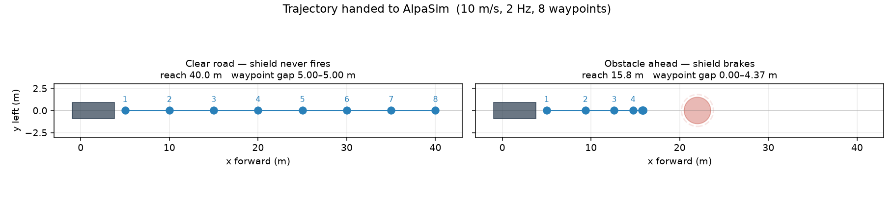

# shield-in-alpasim

Wrap [kitti-nav](https://github.com/matthewhamilton3141/kitti-nav)'s hard safety shield as a
driver plugin for [NVIDIA AlpaSim](https://github.com/NVlabs/alpasim), NVIDIA's open-source
closed-loop AV validation harness (the companion sim to **Alpamayo**), and use it to filter a
learned camera policy. The question this repo exists to answer: does a shield that provably
holds 0 collisions on real KITTI drives still earn its keep when dropped into a harder,
photorealistic closed-loop environment it was never tuned on?

**Status: working, with a result.** The shield runs as a *decorator* over AlpaSim's VaVAM
camera driver: VaVAM proposes a trajectory, the shield certifies it against ground-truth scene
geometry, and only alters it when it must. Both problems the earlier scaffold flagged as open
(below) are solved. See the numbers below and the full trail in
[`HANDOFF.md`](HANDOFF.md).

## The result

8 scenes × 3 rollouts, VaVAM ± shield (all fixes on), on the NuRec sample set:

| | unshielded VaVAM | shielded VaVAM |
| --- | --- | --- |
| mean at-fault collision rate | 0.125 | **0.042** (~3× fewer) |
| outright failures | 2 | **0** |
| mean route progress | 0.80 | **0.80** |

**The hard shield cuts at-fault collisions ~3× and eliminates outright failures at no net
progress cost** — the progress it spends braking on some scenes is offset by rescuing others
(an offroad departure and an at-fault crash both became clean drives). Below: the same scene,
same policy, unshielded (drives into an at-fault collision) vs shielded (vetoes and completes it).

Honest caveats, stated plainly (details in `HANDOFF.md`):
- **VaVAM is stochastic** — the unshielded at-fault rate swung 0.21→0.125 between two sweeps
  from seed variance alone, so `n = 3` numbers are *directional*; publication-grade wants n ≥ 10.
- **One residual scene** where the shield still introduces an at-fault collision (non-highway,
  uncharacterized) — the next thing to diagnose.
- **A characterized failure mode, and its fix.** On a highway scene the shield *caused* a crash:
  the ego was at 17 m/s but kitti-nav's kinematic model clamps to `max_speed = 15`, so its
  stopping-distance reasoning was out of domain and it hard-braked into a collision VaVAM had
  steered around. The **out-of-domain guard** now makes the shield *defer* to the policy above
  its modelled speed rather than certify with a wrong model. A certificate is only as good as
  the model it rests on — and this repo measures exactly that.
- **Learned perception works — but it's front-camera-only, so the shield is blind to the sides.**
  A second arm builds the obstacle field from the front camera itself (monocular metric depth →
  BEV occupancy, `$SHIELD_OBSTACLE_SOURCE=camera`) instead of ground-truth geometry; across the
  same 8 scenes it *barely degrades* the guarantee (at-fault `0.083 → 0.0`, progress ~flat). But a
  single front camera perceives only a forward cone: on one scene the ego collided with a
  *laterally-adjacent* car it never saw (verified in the BEV debug dump — the nearest close
  obstacle was to the side/rear in ~90% of cycles and the camera perceived none of them). So a
  camera-perception shield only guards what it can see. **Surround cameras are the next step** —
  the plan is in [`docs/MULTICAM_HANDOFF.md`](docs/MULTICAM_HANDOFF.md).

## The gap, and how it was closed

AlpaSim's driver interface (`alpasim_driver.models.base.BaseTrajectoryModel`) is **vision-first**:
a driver receives `PredictionInput` (multi-camera RGB, speed, a coarse LEFT/STRAIGHT/RIGHT
command, `ego_pose_history`, an optional route, ...) and must return a `ModelPrediction` — **6-DoF
waypoint poses** in the rig frame, not a low-level `(accel, steer)`. Nothing in that input carries
geometry.

kitti-nav's shield (`kitti_nav.vehicle.safety_shield`) is the opposite shape: it filters a per-step
`(accel_cmd, steer_cmd)` against an `ObstacleField` and returns a certified-safe `(accel, steer)`.
So this was never a drop-in adapter. Two real problems, both now solved:

1. **Where does the shield's obstacle field come from?** AlpaSim hands the driver camera frames,
   not geometry — but the same geometry the simulator steps is loadable straight off the scene
   `.usdz` artifact (`alpasim_utils.scene_data_source`). `obstacles.py`/`scene.py` sample the
   scene's actors at the current ego pose into a kitti-nav `CircleField`. This is the privileged,
   "ground-truth geometry" arm: the scene id is withheld from real benchmark runs by design, so
   it is a baseline, not a leaderboard score — the sharper experiment (not yet built) swaps in
   learned perception and measures how much the certificate degrades.
2. **The shield outputs a per-step command; AlpaSim wants a trajectory — and there's a policy to
   filter.** `control.py` is a pure-pursuit + speed-profile tracker that turns the inner policy's
   waypoints into the per-step commands the shield certifies; the shield then rolls them forward
   into the waypoint sequence `ModelPrediction` expects. When the shield doesn't intervene, the
   policy's plan is passed through verbatim (a filter only alters its input when it must).

## How it works

`ShieldedDriver` (registered as `shielded` / `shielded_vavam`) is a decorator over any registered
`alpasim.models` policy, named via `$SHIELD_INNER_MODEL`:

```
inner policy → proposed waypoints → pure-pursuit tracker → (accel, steer) per step
   → kitti-nav shield (braking-aware, against ground-truth CircleField)
   → certified waypoints    [or the policy's plan verbatim if the shield had no objection]
```

Four behaviours, each measured on the box and each toggleable by env var for A/B:
- **trajectory horizon** — emit ≥ the controller's 2 s MPC horizon (a 0.6 s plan got clamped to
  its endpoint and braked to a stop; both arms stalled at ~8 m before this).
- **passthrough** (`SHIELD_PASSTHROUGH`) — emit the policy's plan when the shield is quiet.
- **rear-filter** (`SHIELD_REAR_FILTER`) — ignore obstacles a forward-only shield can't hit.
- **out-of-domain guard** (`SHIELD_OOD_GUARD`) — defer to the policy above the shield's `max_speed`.

The shield itself is not implemented here — it is imported from kitti-nav (see `ATTRIBUTION.md`).

## Seeing it work

No AlpaSim, no GPU, no scene assets — the tracker + shield core is pure numpy:

```bash
python3 -m pytest -q                    # 53 tests
python3 scripts/preview_trajectory.py   # -> docs/preview.png
```



Both panels are the code path AlpaSim drives — `_rollout`'s `(T, 2)` waypoints. Left: clear road.
Right: an obstacle in the lane, the shield brakes, and the waypoints stop short of it. (This panel
injects an obstacle by hand; inside AlpaSim the field comes from the scene's real actors.)

Inside AlpaSim the views come from its own eval stage (`eval.video.video_layouts=[DEFAULT]`), which
renders a BEV + camera + metrics `mp4` per rollout and sorts clips into per-violation directories
(`collision_at_fault/`, `offroad/`). That directory count is the real scoreboard.

## Running it

The full pipeline needs a machine with AlpaSim, a GPU (for VaVAM; the shield itself is numpy), and
NuRec scene assets. The driver-container wiring (mounting the out-of-tree plugin + kitti-nav into
the `alpasim-base` image and installing them at container start) is baked into the `shielded_vavam`
config, so from an AlpaSim checkout it is:

```bash
# arm the shield with the scene's ground-truth geometry (container-side path), then:
export SHIELD_SCENE_USDZ_IN_CONTAINER=/mnt/nre-data/all-usdzs/<scene>.usdz
uv run alpasim_wizard deploy=local topology=1gpu driver=shielded_vavam \
    scenes.scene_ids='[clipgt-...]' eval.video.video_layouts=[DEFAULT]
```

`scripts/scene_sweep.sh` and `scripts/shield_ab.sh` run the unshielded-vs-shielded sweep and the
per-flag A/Bs. [`docs/BOX_SETUP.md`](docs/BOX_SETUP.md) has the full cost-aware box runbook, and
[`HANDOFF.md`](HANDOFF.md) is the session-by-session record of how this was built and debugged.

## Why a separate repo

Same reason [kitti-nav](https://github.com/matthewhamilton3141/kitti-nav) split off from
[gsplat-rt](https://github.com/matthewhamilton3141/gsplat-rt): a different dependency stack
(AlpaSim's microservices, NuRec assets, a driver-plugin entry-point system) and a different story
(closed-loop validation of a driving policy). This repo consumes kitti-nav's shield as a dependency
rather than duplicating it.

## Dependencies

- [kitti-nav](https://github.com/matthewhamilton3141/kitti-nav) — the shield, a sibling checkout
  (see `ATTRIBUTION.md`), not copied.
- [AlpaSim](https://github.com/NVlabs/alpasim) — the harness this plugs into. Apache 2.0.

## License

MIT (this repo's code). See `ATTRIBUTION.md` for AlpaSim's and kitti-nav's licenses.
