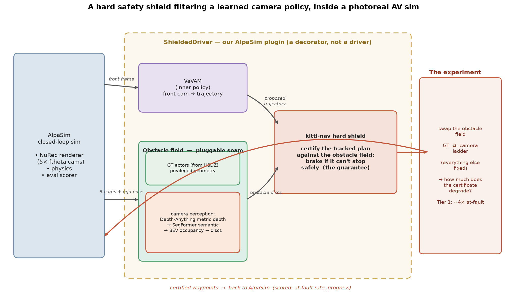
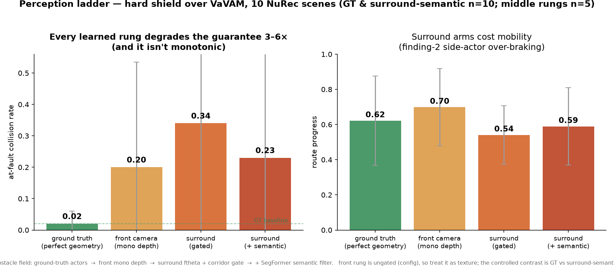
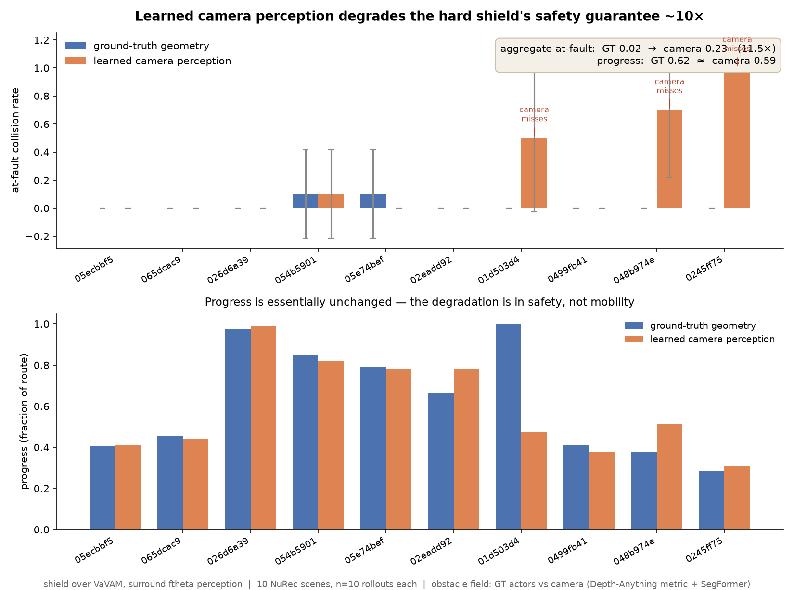
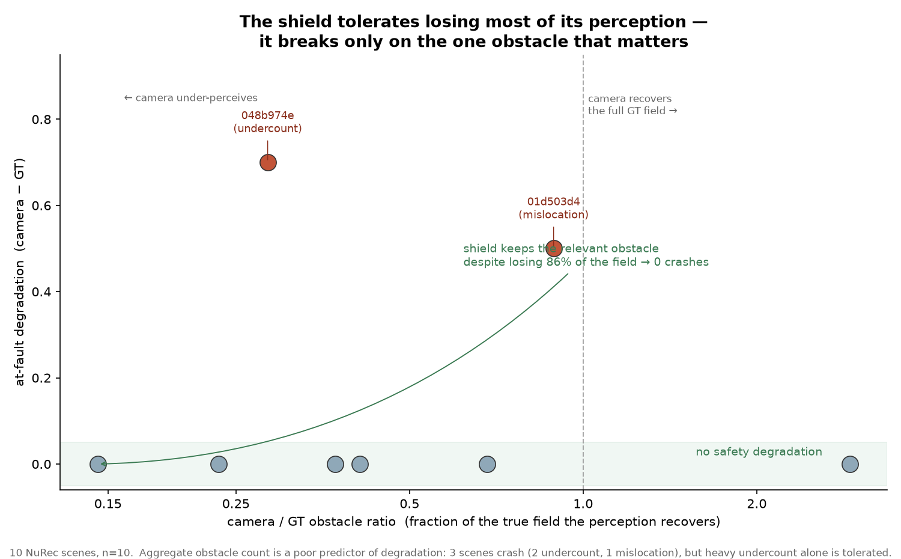

# How much of a hard safety guarantee survives learned perception?

**A hard safety shield — one that provably holds 0 collisions on real KITTI drives — filtering a
learned camera policy (VaVAM) inside NVIDIA's photoreal closed-loop AV sim (AlpaSim). The result:
the shield's guarantee holds under *ground-truth* geometry, but when its obstacle field comes from
learned camera perception the at-fault collision rate degrades by roughly an order of magnitude
(near-zero → 0.23), at unchanged progress — and the degradation has a specific, measured
mechanism.**

This is the write-up. The running log and every dead end are in [`../HANDOFF.md`](../HANDOFF.md);
the code entry points are in [`../README.md`](../README.md).

---

## The question

A safety *shield* is a filter: it takes a policy's proposed action and either certifies it or
overrides it with a provably safe one. kitti-nav's shield does this with a braking certificate —
it refuses any command from which the car cannot still stop before the nearest obstacle. On recorded
KITTI drives that guarantee is airtight.

But a certificate is only as sound as the geometry it is computed against. Drop the shield into a
harder world — a photoreal camera sim it was never tuned on — and give it an obstacle field built by
*learned perception* instead of ground truth, and "provably no collisions" quietly becomes "no
collisions **if perception was right**." That gap is the exact failure a shield is supposed to
prevent. This project measures how wide it is.

## The system



The shield runs as a **decorator** over AlpaSim's VaVAM camera driver, not as a standalone driver
(it is a filter — it never proposes an action, so it cannot drive alone). Each cycle: VaVAM proposes
a trajectory from the front camera; a pure-pursuit tracker turns that plan into per-step
`(accel, steer)`; the kitti-nav shield certifies each step against an **obstacle field** and brakes
if the car could not stop safely; the certified waypoints go back to AlpaSim.

The obstacle field is a **pluggable seam** — and it is the independent variable of the whole
experiment:

- **Ground truth** — the scene's actual actor boxes, read from the USDZ (privileged; the guarantee
  is intact).
- **Learned camera** — a real 5-camera ftheta *surround* rig → monocular metric depth
  (Depth-Anything) → an optional SegFormer semantic filter → BEV occupancy → obstacle discs.

Swap the field, hold everything else fixed, and measure what the certificate loses.

## Tier 0 — does the perception even work on fisheye?

The surround rig renders **ftheta fisheye** frames; the depth and segmentation models were trained
on rectilinear images. First question: does SegFormer produce sane masks on the distorted frames, or
does it need to fall back to a geometric gate? **It works.** On the NuRec frames the class histogram
is dominated by road / building / vegetation / sky, with vehicle and pedestrian pixels landing on the
actual cars — bus 16.7% on the cross-left camera, car 9.1% + truck 3.5% on the rear-left, masks
tracking the real vehicles despite the fisheye curvature. No gate-only fallback needed.

## Tier 1 — the degradation, across the perception ladder

10 curated NuRec scenes (screened so VaVAM stays on-route — drift is a separate confound). The two
endpoints (GT and surround-semantic) are at **n = 10**; the middle rungs at n = 5 (texture).
Obstacle field swept across four rungs from perfect geometry to the full learned stack:



| at-fault | GT | front (mono) | surround (gated) | surround (+ semantic) |
| --- | --- | --- | --- | --- |
| collision rate | 0.02 | 0.20 | 0.34 | 0.23 |
| route progress | 0.62 | 0.70 | 0.54 | 0.59 |

**Every learned rung degrades the guarantee 3–6× versus ground truth, and it is *not* monotonic in
"sophistication."** Surround-gated is the worst: its side cameras feed the shield abeam actors that
trip kitti-nav's omnidirectional-clearance over-braking (the progress dip to 0.54), while its
geometric gate still under-perceives the collision-relevant obstacle. The semantic filter *helps*
over gate-only (0.34 → 0.23). The headline, controlled contrast is **GT vs surround-semantic**: the
shield with true geometry is essentially crash-free (**0.02**), learned perception takes it to
**0.23** — roughly an order of magnitude.



**The degradation is in *safety*, not mobility** — progress is essentially flat across the swap
(0.62 → 0.59). "More collisions, same distance."

## The mechanism — the shield fails on the one obstacle that matters

Is the degradation just "camera sees fewer obstacles"? No — and this is the most interesting finding:



The shield is **remarkably robust to losing most of its perception.** On several scenes the camera
recovers only 14–40% of the true obstacle field — losing 60–86% of it — at **zero** safety cost
(`065dcac9`: 84 obstacles → 13, still 0 crashes). Aggregate obstacle count is a *poor* predictor of
degradation. The shield breaks on only 3 of 10 scenes, in two distinct modes:

- **Under-count (2 scenes)** — the perception drops the specific collision-relevant obstacle.
  Sharpest case `048b974e`: GT carries ~250 obstacles/cycle and the shield never crashes; the camera
  carries ~70, misses the lead vehicle, and crashes in 7 of 10 rollouts (`0245ff75` is the same
  story, ~135 → 22, crashing all 10).
- **Mis-location (1 scene)** — `01d503d4`: the camera recovers the *full* field (ratio ~0.9) but
  places the relevant vehicle wrong, so the certificate is computed against a phantom.

So the honest, sharper claim is not "learned perception is worse" but: **a hard shield tolerates
massive perception loss and fails narrowly — only when perception loses or mislocates the one
obstacle the certificate hinges on.** That is a far more useful thing to know than an aggregate
number.

## Seeing it work

The clean end-to-end demonstration, same scene (`01d503d4`), same VaVAM policy, ground-truth field:

- **Unshielded VaVAM** drives into an at-fault collision — *deterministically*, all 3 rollouts.
- **Shielded** completes the full route with **0 collisions** — deterministically, all 3 rollouts.

The hard shield turns a guaranteed crash into a clean drive. (Clips in `out_tier0_result/hero/`.)

## Honest caveats

- **VaVAM is stochastic.** The headline endpoints are at n = 10; the per-scene at-fault rates still
  carry sizable variance (std up to ~0.5 on crash scenes), so read *per-scene* numbers as
  directional — but the aggregate contrast (GT ~0.02 vs camera ~0.23) is robust across the sweep.
- The **front-camera rung is ungated** by config, so it is texture, not a controlled variable; the
  clean contrast is GT vs surround-semantic.
- A tried-and-rejected fix: dropping abeam actors to cut the over-braking (`SHIELD_SIDE_CORRIDOR`)
  was **safety-neutral but recovered little progress** — the dense-scene over-braking is mostly
  genuine near/ahead traffic, not far-abeam actors. Kept, gated, off by default.
- The GT baseline uses AlpaSim's near-clean `rig_est` ego frame (localization noise is identity by
  default), so this isolates *perception*, not localization.

## Reproduce

```bash
python3 -m pytest -q                        # 102 tests, no GPU
python3 scripts/make_ladder_figure.py       # the ladder     (from results/tier1_*.csv)
python3 scripts/make_degradation_figure.py  # GT vs camera
python3 scripts/make_mechanism_figure.py    # the mechanism
python3 scripts/make_architecture_diagram.py
```

The box-side sweep scripts are in [`../scripts/box/`](../scripts/box); the compute plan is in
[`COMPUTE_PLAN.md`](COMPUTE_PLAN.md).
