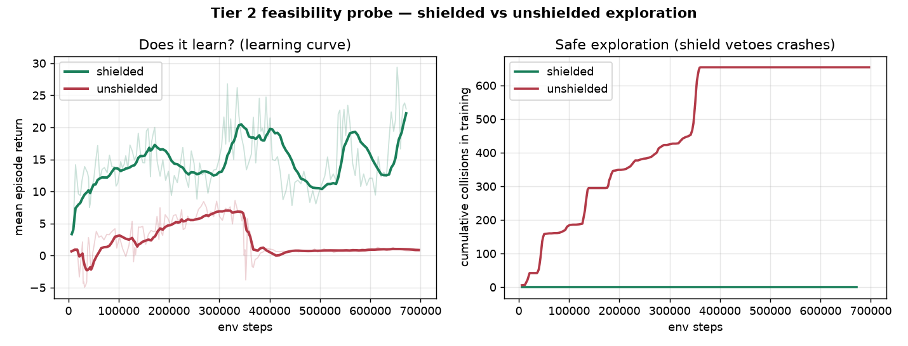
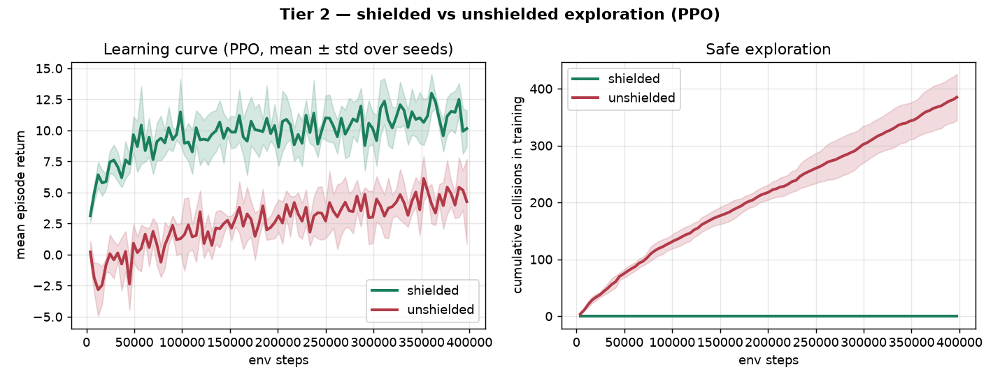
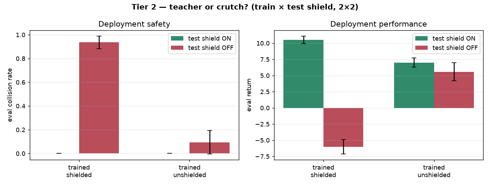
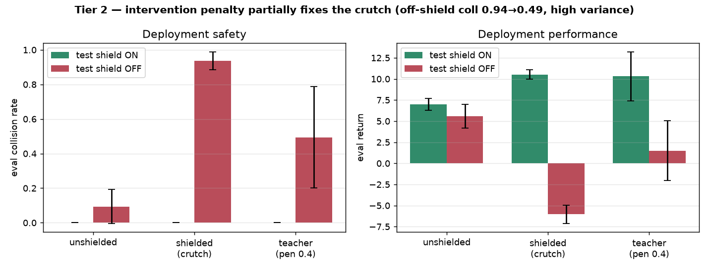

# Tier 2 feasibility probe — safe RL via shielding: **GO**

Scoped 2026-08-16. The question the kickoff gated the whole tier behind: *can a policy learn
inside this system under the shield, cheaply enough to be worth the credits?* Answer: **yes, and
the mechanism is already demonstrable at toy scale.** No GPU was spent reaching this verdict.

## The feasibility finding (why the probe looks the way it does)

**AlpaSim exposes no RL training interface.** It is a gRPC closed-loop *eval* harness — services
(`egodriver / controller / physics / sensorsim / traffic`) orchestrated per rollout, scorers
(`collision`, `offroad`, `progress`, `safety`) computed *post-hoc*. There is no reward, no reset,
no per-step action injection (`grep` for `reward|gym|reset|ppo|train` across `~/alpasim/src` =
zero hits). The only action seam is `ShieldedDriver.predict()` returning a trajectory each cycle,
and each env step there is a NuRec render (~seconds) with a docker/service bring-up per episode
(~6–10 min). Training RL directly against the photoreal loop — millions of steps — is **infeasible
at any budget.**

**But the shield already ships its own fast training world.** `kitti_nav.vehicle` is a
self-contained pure-numpy kinematic sim with exactly the primitives AlpaSim lacks:

| RL primitive | kitti-nav |
| --- | --- |
| transition (step) | `step_state(state, accel, steer, cfg)` |
| the veto (safe exploration) | `safety_shield(...)` — least-restrictive certified action |
| reward / done / obstacles | `clearance`, `can_stop_safely`, `CircleField` |

It runs at ~10⁴ steps/s on one CPU core. So the feasible Tier 2, and the standard shielding-RL
setup: **train a low-dim policy in the kitti-nav surrogate *under the shield*, then evaluate the
learned policy in AlpaSim's photoreal loop** (AlpaSim's actual strength — and the eval ties back
to the Tier 1 finding that perception degrades the shield). Honest caveat to carry into any
write-up: *training is in the shield's kinematic surrogate, not the photoreal sim.*

## The probe

`ShieldNavEnv` (`src/shield_in_alpasim/rl_env.py`): a corridor-navigation task over the shield's
own model — thread 4 obstacle discs to a goal line without leaving the corridor; obs is low-dim
(ego speed/steer/dist-to-goal + nearest-4 discs in the rig frame); 15 discrete `(accel, steer)`
actions. One boolean is the whole experiment: `shield=True` routes every action through
`safety_shield` before the world sees it. A random-feature softmax policy trained with REINFORCE
(`scripts/rl_probe.py`, pure numpy, no torch, ~4 min/arm on a laptop). Two arms, identical except
the shield flag; held-out greedy + stochastic eval.

Load-bearing unit test (`tests/test_rl_env.py`): with the shield on and a certified start, the
agent **never collides across 40 random layouts even under a full-throttle-into-obstacles policy**;
the same reckless stream without the shield does collide. The safe-exploration guarantee is a test,
not a hope.

## Result (150 iters × 40 episodes/arm, ~700k env steps each)



| arm | return (initial → converged) | **collisions during training** | greedy goal-rate | eval collisions |
| --- | --- | --- | --- | --- |
| **shielded** | **7.4 → 17.7** (peak 22.9) | **0** | **0.30** | 0.00 |
| unshielded | 0.9 → 0.9 | **654** | 0.00 | 0.00 |

Three things, all pointing the same way:

1. **Something learns under the shield** — return rises ~3× to a policy that completes 30% of
   held-out layouts, crash-free (greedy and stochastic eval agree at ~0.30, so it's a real learned
   policy, not eval-mode luck).
2. **Shielded exploration is safe** — **0 collisions in 6,000 training episodes** vs the unshielded
   arm's **654**. Exactly the guarantee: from a certified start the shield's induction holds, so the
   agent provably never crashes *while learning*.
3. **Shielding did not cost learning — it enabled it.** The unshielded arm *collapsed*: around
   350k steps its return drops to ~0 and its collision count plateaus, because crash penalties
   terminate episodes and drown the forward-progress signal, so the policy flees to a do-nothing
   local optimum (goal-rate 0, but also crash-rate 0 — it learned to sit still). The shield removes
   that pathology by keeping every episode alive and on the road.

## Honest caveats

- **Surrogate, not photoreal.** This trains in the shield's kinematic world; the point is
  feasibility of the *learning*, not a finished driving policy. AlpaSim is the eval, not the trainer.
- **The unshielded baseline is deliberately vanilla.** Its collapse is partly the reward shape
  (a large collision penalty on episode termination); a tuned unshielded baseline (reward
  reshaping, penalty annealing) would likely learn *something*. The robust, defensible claim is the
  one the guarantee makes for free: **shielded exploration is crash-free during training and learns
  a competent policy at a sane budget** — not "unshielded RL can never learn."
- Tiny scale (700k steps, one seed/arm, a random-feature policy). This is a go/no-go probe, not the
  result. The scaled run below is where the numbers get error bars.

## Verdict: **GO** — and the scaled run confirms it with statistics

The probe earned the scaled run; it is now done (`scripts/rl_scaled.py`): a proper **MLP
actor-critic trained with PPO** (GAE, clip, annealed entropy), **5 seeds per arm × 400k steps**,
on a harder 6-obstacle corridor, mean ± std over seeds. Still CPU-only, ~$0.



| arm (5 seeds, PPO) | converged return | **training collisions / seed** | eval return | **eval collision rate** |
| --- | --- | --- | --- | --- |
| **shielded** | **11.2** | **0** | **11.0 ± 1.0** | **0.00** |
| unshielded | 4.5 | **385** | 4.1 ± 1.4 | 0.11 |

The seed-averaged bands barely overlap: **shielded exploration learns to ~2.5× the unshielded
return**, with **tighter** variance, **zero collisions across all five seeds (2M shielded steps)**,
and a final policy that is **crash-free at eval (0.00 vs 0.11)**. The unshielded arm not only racks
up ~385 crashes/seed *while* learning, its converged policy is still unsafe (11% eval collisions)
and lower-return. Shielding made learning safer, better, *and* lower-variance — the Tier 2 thesis,
now with error bars.

**Honest caveat:** absolute goal-completion is low on this deliberately hard task (~2% shielded)
— the return separation is the progress-safely signal, not full route completion; more steps or a
curriculum would raise completion. The comparison (safety + return, both with error bars) is the
result, and it is decisive.

## The sharper question — is the shield a teacher or a crutch?

Shielded-RL's known catch (Alshiekh et al. 2018): a policy trained under a shield may just learn
to *lean* on it. So we evaluated every trained policy in a 2×2 — trained shield-on/off × deployed
shield-on/off (`scripts/rl_transfer.py`, 5 seeds):



| train \ deploy | shield ON | **shield OFF** |
| --- | --- | --- |
| **shielded** | coll 0.00, ret 10.5 | coll **0.94**, ret −6.0 |
| **unshielded** | coll 0.00, ret 7.0 | coll **0.09**, ret 5.6 |

**It's a crutch.** Remove the shield at deployment and the shield-trained policy collides **0.94** —
*more* dangerous than a policy that trained without a shield and learned caution the hard way
(0.09). The safety lived in the shield, not the policy. And the shield made learning **far faster**:
shielded reached return ≥ 8 in **~59k steps (5/5 seeds)**; unshielded **never reached it (0/5)**.

This is the unifying result. The shield is a runtime filter, so its guarantee is *its own*, not the
policy's — which is exactly why **Tier 1's question (how good is the shield when perception is
learned, not perfect?) is the crux of the whole system**: at deployment the shield must stay, and
it is only as safe as what it perceives.

## Fixing the crutch — penalise leaning on the shield

If the policy pays nothing for proposing unsafe actions (the shield silently fixes them), it never
learns to avoid them. So we add an **intervention penalty** (`EnvConfig.intervention_penalty`): a
cost each step the shield overrides the policy. Exploration stays 100% safe (the shield still
vetoes — 0 training crashes), but the policy is now rewarded for not *needing* it
(`scripts/rl_teacher.py`, 5 seeds, penalty 0.4):



| deploy shield OFF | collision | return |
| --- | --- | --- |
| unshielded | 0.09 | 5.6 |
| shielded (crutch) | 0.94 | −6.0 |
| **teacher (pen 0.4)** | **0.49** | 1.5 |

A single penalty (0.4) only *partially* fixed it (off-shield collision 0.94 → 0.49, high variance),
so we swept the penalty to map the whole trade-off (`scripts/rl_frontier.py`, 5 seeds):


| penalty | off-shield collision | off-shield return | on-shield return |
| --- | --- | --- | --- |
| 0.0 (crutch) | 1.00 | −7.7 | 9.4 |
| 0.3 | 0.69 | −2.8 | 8.7 |
| **0.6** | **0.12** | **+4.1** | 6.1 |
| 1.0 | 0.06 | 2.6 | 3.4 |
| 1.5 | 0.04 | 0.9 | 1.8 |

**The penalty is a clean, monotone knob** on a safety–performance frontier. At **penalty 0.6** the
policy — still trained **100% crash-free** — deploys *without* the shield at collision **0.12**,
essentially matching the unshielded-trained floor (0.09), with *positive* return: a genuine
teacher. Push harder (1.0–1.5) and off-shield collision drops *below* the unshielded floor (0.04),
but the policy turns timid (return collapses). So the crutch is fixable: **safe exploration and a
policy safe *without* the shield are separable goals, and reward shape buys the second along a
tunable frontier** — you choose how much deployment performance to trade for shield-free safety.

### The one remaining, box-dependent step

**Evaluate the shield-trained policy in AlpaSim** closed-loop (a few dozen renders, ~$10–30):
does a policy raised under the shield transfer to the photoreal sim, and how does it fare when the
shield's obstacle field comes from *learned camera perception* (the Tier 1 seam)? The `layouts`
hook on `ShieldNavEnv` also lets the scaled run train on obstacle fields *sampled from the 10
curated NuRec scenes* (GT actors via `SceneObstacleSource`) so the training distribution matches
the eval — both need a GPU box (re-provision with `setup_box.sh`).

Reproduce:
```bash
python3 scripts/rl_probe.py     # feasibility probe   -> results/rl_probe.{csv,png}
python3 scripts/rl_scaled.py    # PPO, 5 seeds/arm     -> results/rl_scaled.{csv,png}
python3 scripts/rl_transfer.py  # teacher-or-crutch 2×2 -> results/rl_transfer.{csv,png}
python3 scripts/rl_teacher.py   # intervention-penalty fix -> results/rl_teacher.{csv,png}
python3 scripts/rl_frontier.py  # penalty safety/perf frontier -> results/rl_frontier.{csv,png}
python3 scripts/rl_video.py     # BEV preview video    -> results/rl_tier2_preview.mp4
python3 -m pytest -q            # 111 tests, no GPU
```
